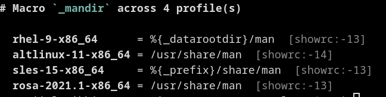

# Getting started

This page walks you from a fresh install to a linted, reformatted spec
in five minutes. After that, jump to the [editing workflow](workflow.md)
for the day-to-day loop, or to the [CLI reference](cli.md) for the full
flag catalogue.

## Install

Pre-built `.tar.gz`, `.deb`, and `.rpm` artifacts ship with every
`vX.Y.Z` tag on the
[GitHub releases page](https://github.com/johnlepikhin/rpm-spec-tool/releases)
for Linux `x86_64` and `aarch64`.

```bash
# Debian / Ubuntu derivatives:
sudo apt install ./rpm-spec-tool_X.Y.Z-1_amd64.deb

# RHEL / Fedora derivatives:
sudo dnf install ./rpm-spec-tool-X.Y.Z-1.x86_64.rpm
```

To build from source you need Rust **1.88** or newer:

```bash
cargo install --git https://github.com/johnlepikhin/rpm-spec-tool rpm-spec-tool
```

[`shellcheck`](https://www.shellcheck.net/) is an optional dependency —
install it to enable the script-section lint (`RPM200`). The official
packages list it as `Recommends` / `Suggests`.

For editor integration (LSP) and shell completions see
[editor-integration.md](editor-integration.md).

## The five core subcommands

| Command | Purpose |
| ------- | ------- |
| `lint`   | Run lint rules and emit diagnostics (human / JSON / SARIF). |
| `format` | Canonical reformat — `--check`, `--in-place`, `--diff`. |
| `pretty` | Indented, ANSI-coloured view for reading. Display only. |
| `check`  | `lint` + `format --check` in one CI-friendly invocation. |
| `ast`    | Dump the parsed AST as JSON / YAML for downstream tooling. |

Everything else (`profile`, `target`, `matrix`, `repo`, `lints`,
`config`, `completions`) supports those five.

Every spec-taking command reads from **stdin** when the path is `-` or
omitted, and accepts any number of paths for batch runs.

## First lint

Run against any RPM spec — your own, one from a source RPM
(`rpm2cpio foo.src.rpm | cpio -i \*.spec`), or one of the bad-input
fixtures in [`tests/fixtures/`](../tests/fixtures/):

```bash
rpm-spec-tool lint myproject.spec
```

Without `--profile` the analyzer runs in the generic baseline — every
core lint fires, but family-gated rules (RHEL / SUSE / ALT Linux
conventions) stay silent. Pick a target so those wake up:

```bash
rpm-spec-tool lint --profile rhel-9-x86_64 myproject.spec
```

Output is `codespan`-style with cross-references and machine-applicable
suggestions:

<p align="center">
  
</p>

`profile list` shows every built-in profile; see
[profiles.md](profiles.md) for the model.

## Apply machine-applicable fixes

Diagnostics that ship with a safe rewrite carry a `[fix]` marker. Apply
them in place:

```bash
rpm-spec-tool lint --fix --profile rhel-9-x86_64 myproject.spec
```

To also commit "maybe-incorrect" rewrites (`Suggested` level), pass
`--fix-suggested` on top. The default `--fix` is conservative — it
applies only rewrites the analyzer is sure of.

After a `--fix` run the file ends up modified but possibly not
canonically formatted; chain `format --in-place` to finish the job:

```bash
rpm-spec-tool lint   --fix --profile rhel-9-x86_64 myproject.spec
rpm-spec-tool format --in-place                    myproject.spec
```

## Reformat or preview the canonical form

`format` writes the canonical, RPM-compatible form. Three modes:

```bash
rpm-spec-tool format --check    myproject.spec   # CI dry-run; exit 1 if it'd change
rpm-spec-tool format --in-place myproject.spec   # overwrite
rpm-spec-tool format --diff     myproject.spec   # unified diff
```

<p align="center">
  
</p>

`pretty` produces the same shape but with ANSI syntax highlighting and
optional indentation of `%if` blocks — strictly a **display** mode,
never a round-trip target (RPM rejects indented `%if` directives):

<p align="center">
  
</p>

## One-shot CI gate

`check` runs `lint` and `format --check` together and exits non-zero on
any failure of either. The intended CI shorthand:

```bash
rpm-spec-tool check --profile rhel-9-x86_64 myproject.spec
```

Exit codes follow the lint convention:

| Code | Meaning |
| ---- | ------- |
| `0`  | clean |
| `1`  | lint deny-severity finding **or** would-reformat |
| `2`  | parse error, I/O failure, or invalid CLI |

For machine-readable diagnostics:

```bash
rpm-spec-tool lint --format sarif myproject.spec > spec.sarif
```

The SARIF output drops cleanly into GitHub Code Scanning — see
[ci-integration.md](ci-integration.md).

## Pick a distribution profile

The analyzer doesn't guess anything about your host. It reads the
target system from a *profile*: identity (family / vendor / dist-tag),
macros, rpmlib features, license / group whitelists. 24 profiles ship
in the binary:

```bash
rpm-spec-tool profile list           # full catalogue
rpm-spec-tool profile show rhel-9-x86_64
rpm-spec-tool profile macro dist     # compare across every profile
```

The screenshot below shows `profile macro dist rhel-9-x86_64
rhel-10-x86_64` — the same logical macro resolves differently per
target:

<p align="center">
  
</p>

Pick the active profile via CLI flag or in `rpmspec.toml`. Full model
in [profiles.md](profiles.md); the config file in
[configuration.md](configuration.md).

## Create the config file

A minimal `.rpmspec.toml` next to your specs lets you fix the profile,
override severities, and pin lint defines so collaborators all see the
same diagnostics:

```bash
rpm-spec-tool config init --profile rhel-9-x86_64
# Writes ~/.config/rpm-spec-tool/rpmspec.toml by default.
# Use --output PATH to drop it next to the spec instead.
```

The generated file is heavily commented and discoverable. Use
`--all-lints` to bake every built-in rule as a commented entry so the
file doubles as a per-rule catalogue.

## Next steps

* [Editing workflow](workflow.md) — the full edit / lint / fix / commit
  loop, with screenshots and the pre-commit recipe.
* [CLI reference](cli.md) — every subcommand in one place.
* [Configuration](configuration.md) — the `rpmspec.toml` schema and the
  `config` subcommand tree.
* [Lint system](lints.md) — severity model, fix levels, category
  filters; pairs with the auto-generated
  [`lints-list.md`](lints-list.md).
* [Distribution profiles](profiles.md) — built-ins, layering rules,
  `rpm --showrc` ingestion.
* [Release matrix](matrix.md) — lint a single spec against many target
  distributions in one invocation.
* [Editor integration](editor-integration.md) — LSP setup for Neovim,
  Helix, Emacs, VS Code.
* [CI integration](ci-integration.md) — GitHub Actions recipes, SARIF
  upload, matrix baselines.
