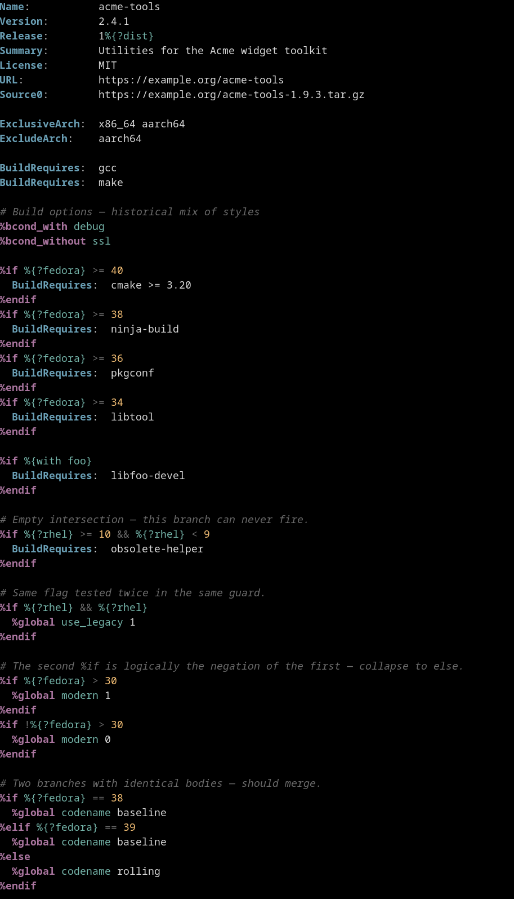
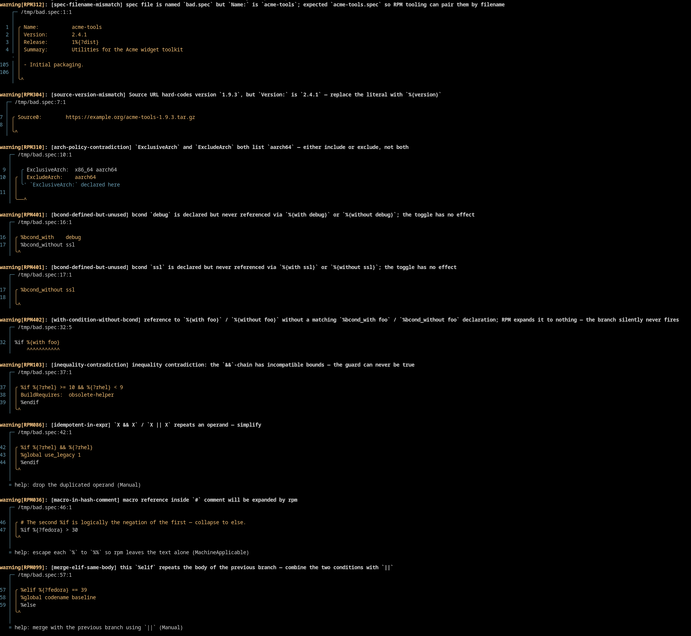
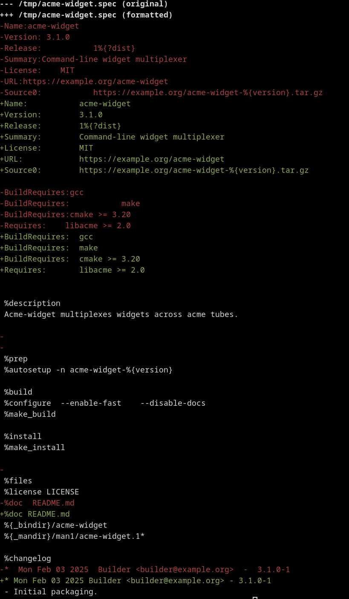

# Editing workflow

This page covers the end-to-end loop for **creating** a new
`.spec` file and for **editing** an existing one with `rpm-spec-tool`
in the loop. If you have not run the tool before, start with
[getting-started.md](getting-started.md) — it covers installation and
the five core subcommands.

## The loop in one diagram

```
                 ┌─────────────────────────────────────────────────────┐
                 │                                                     │
                 ▼                                                     │
┌─────────┐   ┌──────────┐   ┌──────────┐   ┌──────────┐   ┌────────────┐
│  edit   │──▶│  pretty  │──▶│   lint   │──▶│  --fix   │──▶│  format    │
│ (.spec) │   │ (review) │   │ (review) │   │ (auto)   │   │ (--in-place│
└─────────┘   └──────────┘   └──────────┘   └──────────┘   │  or --diff)│
                                  │                        └────────────┘
                                  │ remaining warnings                │
                                  ▼                                   ▼
                            ┌──────────┐                       ┌──────────┐
                            │ manual   │                       │ commit + │
                            │ fix      │                       │  CI gate │
                            └──────────┘                       │  (check) │
                                                               └──────────┘
```

The same loop applies whether you are starting a new package from
scratch or maintaining one that has been in the tree for years. Only
the *first turn* of the loop differs.

## Step 0 — Create or open the spec

### A new package

`rpm-spec-tool` does not ship a template generator (the upstream
`rpmdev-newspec` from `rpmdevtools` does the same job in any
distribution). Get a skeleton first, then bring it into the loop:

```bash
# Optional, only if rpmdev-newspec is installed:
rpmdev-newspec -t app myproject

# Or just write a one-screen skeleton by hand:
cat > myproject.spec <<'SPEC'
Name:           myproject
Version:        1.0.0
Release:        1%{?dist}
Summary:        Short one-line description without trailing dot
License:        MIT
URL:            https://example.com/myproject
Source0:        %{name}-%{version}.tar.gz

BuildRequires:  gcc, make

%description
A longer paragraph describing the package — what it does, who it is
for, and why a user would install it.

%prep
%autosetup

%build
%make_build

%install
%make_install

%files
%license LICENSE
%doc README.md
%{_bindir}/myproject

%changelog
* Mon Jan 01 2026 Maintainer <maint@example.com> - 1.0.0-1
- Initial package.
SPEC
```

Now the file exists, and the loop below applies unchanged.

### Editing an existing spec

```bash
$EDITOR myproject.spec
```

If you have the LSP server installed and configured (see
[editor-integration.md](editor-integration.md)), every keystroke gets
the analyzer's diagnostics inline plus quick-fix code actions — the
loop below collapses to "save, accept fix, save". Without LSP, run the
steps from the shell as written here.

## Step 1 — `pretty` to read what you have

`pretty` writes an indented, ANSI-coloured rendering of the spec to
stdout. It is the **read** mode — it never overwrites the file and the
`%if`/`%endif` indentation it adds is forbidden by RPM, so don't commit
it.

```bash
rpm-spec-tool pretty myproject.spec | less -R
```

<p align="center">
  
</p>

Use this whenever you have inherited a spec and need to grok its
structure — nested conditionals collapse visually, sub-packages stand
out, the preamble lines up. Pair it with the editor for navigation,
not for diffing.

## Step 2 — `lint` to find issues

```bash
rpm-spec-tool lint --profile rhel-9-x86_64 myproject.spec
```

Pick the profile that matches the build target. Without `--profile`
the analyzer falls back to the empty `generic` profile and family-gated
rules stay silent — you'll miss "this macro doesn't exist on SUSE"
warnings.

<p align="center">
  
</p>

Diagnostics carry:

* a rule ID (`RPM031`, `RPM404`, …),
* a primary span and any cross-referenced spans,
* a human message,
* zero or more **suggestions** — proposed replacements.

A suggestion's level is shown as `[fix]` (safe) or `[fix?]` (suggested
/ maybe-incorrect). Safe fixes are mechanical and provably preserve
behaviour; suggested fixes are best-effort rewrites that need a human
read-over.

To list every active rule against the current build:

```bash
rpm-spec-tool lints                            # text, grouped by category
rpm-spec-tool lints --category correctness --severity deny
```

See [lints.md](lints.md) for severity and category semantics; the
auto-generated [lints-list.md](lints-list.md) is the canonical
catalogue.

## Step 3 — `--fix` for everything mechanical

```bash
rpm-spec-tool lint --fix --profile rhel-9-x86_64 myproject.spec
```

Applies every safe fix in place and rewrites the file. To also apply
the maybe-incorrect rewrites — useful on a feature branch you can
inspect with `git diff` — add `--fix-suggested`:

```bash
rpm-spec-tool lint --fix --fix-suggested --profile rhel-9-x86_64 myproject.spec
```

After `--fix`, **always** run `lint` again without `--fix` and review
what is left. The fixes resolve only the mechanical class of issues;
genuine packaging mistakes (wrong scriptlet shape, missing
`BuildRequires`, hard-coded paths) need a human.

## Step 4 — `format` for canonical layout

`format` rewrites whitespace, preamble alignment, line breaks, and
ordering rules into the project's canonical shape. Three modes — pick
the one that matches your workflow:

```bash
# Just show me what would change.
rpm-spec-tool format --diff myproject.spec
```

<p align="center">
  
</p>

```bash
# Apply the formatting.
rpm-spec-tool format --in-place myproject.spec

# CI gate — exit 1 if any file would be reformatted, no writes.
rpm-spec-tool format --check myproject.spec
```

`format` is conservative about layout. It does not move directives
between sections, never reorders human-authored content inside script
bodies, and never indents `%if` (rpm rejects that). Configuration
options live under `[format]` in `rpmspec.toml`:

```toml
[format]
preamble-align-column = 20
conditional-indent    = 0   # set > 0 only for `pretty`, not for commits
```

## Step 5 — `check` before the commit

`check` is `lint` + `format --check` in one process — the CI shorthand,
but also a good final pass locally:

```bash
rpm-spec-tool check --profile rhel-9-x86_64 myproject.spec
```

Exit codes:

* `0` — clean.
* `1` — at least one deny-severity lint **or** the file would be
  reformatted.
* `2` — parse error, I/O, or CLI misuse.

If you have multiple build targets, switch from `check` to
`matrix check` — the next section covers it.

## Step 6 — Multi-target sweep (optional, recommended)

A spec rarely builds on one distribution alone. Declare a target set
in `rpmspec.toml`:

```toml
[targets.release-2026]
profiles = [
  "rhel-8-x86_64",
  "rhel-9-x86_64",
  "altlinux-10-x86_64",
  "sles-15-x86_64",
]
```

…and run every active lint against every member in one invocation:

```bash
rpm-spec-tool matrix check --target-set release-2026 myproject.spec
```

Findings are aggregated — the same warning across N profiles shows up
**once** with an `affected:` list. For the full multi-profile surface
(coverage, portability, diff, baselines, repo-aware deps), see
[matrix.md](matrix.md).

For ad-hoc, no-config runs:

```bash
rpm-spec-tool matrix check \
  --profiles rhel-9-x86_64,altlinux-10-x86_64 myproject.spec
```

## Step 7 — Repository-aware checks (optional)

If you point the tool at the repositories the build will use, it can
verify every `BuildRequires:` and `Requires:` against real package
metadata:

```bash
# One-time / nightly: refresh the on-disk cache (network required).
rpm-spec-tool repo sync --target-set release-2026 --allow-fetch

# Then offline, including in CI:
rpm-spec-tool matrix deps check --target-set release-2026 myproject.spec
```

Default mode is **offline** — neither lint nor `matrix deps check`
will hit the network behind your back. CI runs should pass
`--cache-only` instead of `--allow-fetch` to force a hard error on
cache miss. See [repos.md](repos.md) for the on-disk layout, the
3-state network ladder, and the configuration schema.

## Step 8 — Inspect a specific decision

When a diagnostic surprises you, the `matrix` introspection commands
explain what the analyzer saw:

```bash
# Why is line 183 active on rhel-9 but inactive on altlinux-10?
rpm-spec-tool matrix explain --target-set release-2026 \
  --line 183 myproject.spec

# Which macros referenced by this spec aren't defined on every target?
rpm-spec-tool matrix portability --target-set release-2026 myproject.spec

# What's the per-profile verdict for every %if branch?
rpm-spec-tool matrix coverage --target-set release-2026 myproject.spec

# Render the spec per profile with each %if line tagged.
rpm-spec-tool matrix expand --target-set release-2026 myproject.spec
```

Full reference in [matrix.md](matrix.md).

## Step 9 — Commit, then let CI gate

Once `check` exits 0 locally, commit. CI runs the same `check` (or
`matrix check`) and gates the PR. For machine-readable diagnostics in
GitHub Code Scanning:

```bash
rpm-spec-tool lint --format sarif myproject.spec > spec.sarif
```

For the matrix variant — including baselines that suppress
already-known findings so PRs gate on *new* regressions only — see
[ci-integration.md](ci-integration.md) and the **Baseline mode**
section of [matrix.md](matrix.md#baseline-mode).

## Pre-commit (local)

The shortest local gate is a git pre-commit hook. The project ships
one for itself in [`.githooks/pre-commit`](../.githooks/) — it
regenerates `doc/lints-list.md` when rule code is touched. For *your*
packaging repo, a hook that runs `check` over staged specs catches
most regressions before they leave your machine:

```bash
#!/bin/sh
# .git/hooks/pre-commit
specs=$(git diff --cached --name-only --diff-filter=ACM | grep '\.spec$')
[ -z "$specs" ] && exit 0
rpm-spec-tool check $specs
```

Or, for the matrix variant when you maintain `rpmspec.toml` with a
target set:

```bash
rpm-spec-tool matrix check --target-set release-2026 $specs
```

## Editor in the loop

The LSP server (`rpm-spec-lsp`) folds steps 2–3 into the editor:
diagnostics show up as you type, quick-fix code actions apply the same
rewrites `lint --fix` would, hover surfaces tag docs and profile macro
values, and goto-definition jumps from a `%macro` reference to its
`%define`. See [editor-integration.md](editor-integration.md) for the
Neovim / Helix / Emacs / VS Code recipes.

## When something goes wrong

* **A finding looks wrong.** Check that the active profile matches the
  target (`rpm-spec-tool profile show` prints which one is picked
  up).
* **A `--fix` rewrote something it shouldn't have.** Roll back via
  `git checkout`. The fix probably came from a `--fix-suggested` /
  suggested-level rewrite — re-run with `--fix` only, or silence the
  specific rule (`--allow <id>`).
* **`format` keeps fighting an editor on tabs / column.** Tune
  `[format].preamble-align-column` and `conditional-indent` in
  `rpmspec.toml`; both are documented in
  [configuration.md](configuration.md).
* **`%bcond` flips don't behave the way they would under `rpmbuild`.**
  Pass `--with FEATURE` / `--without FEATURE` exactly like `rpmbuild`
  does — see the **Build conditions** section of
  [matrix.md](matrix.md#build-conditions-bcond_with--bcond_without).
* **A profile is missing macros.** `profile show --full <NAME>` lists
  every macro with provenance; `profile macro <NAME>` compares one
  macro across profiles. Add the missing entry via `[profiles.X.macros]`
  or a `--define`.
